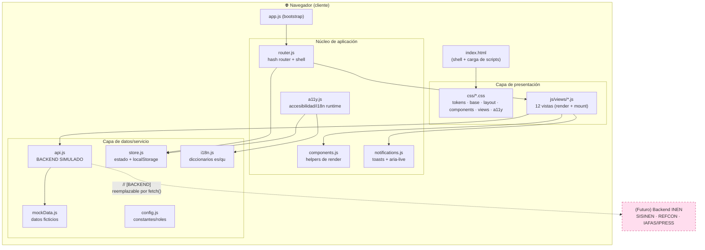
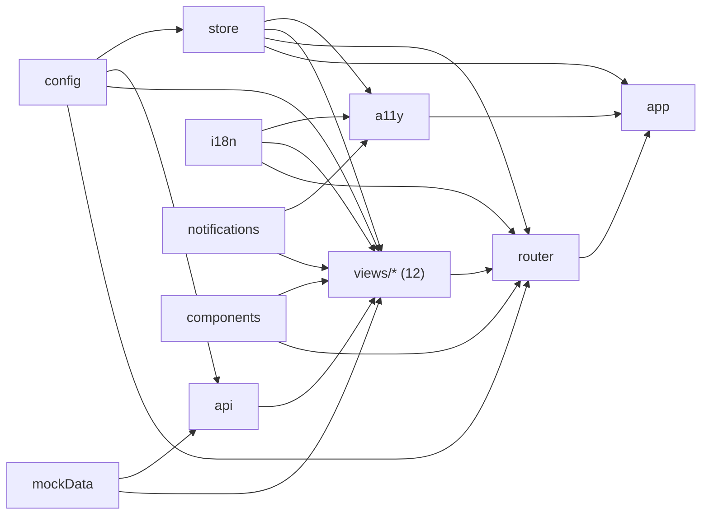
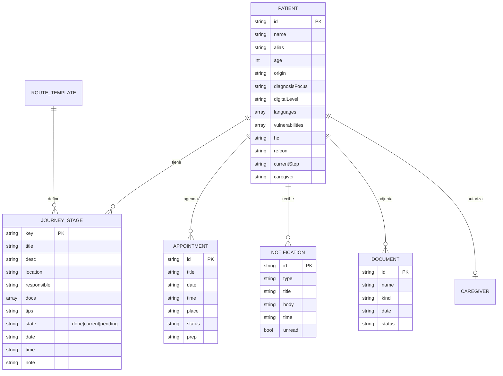
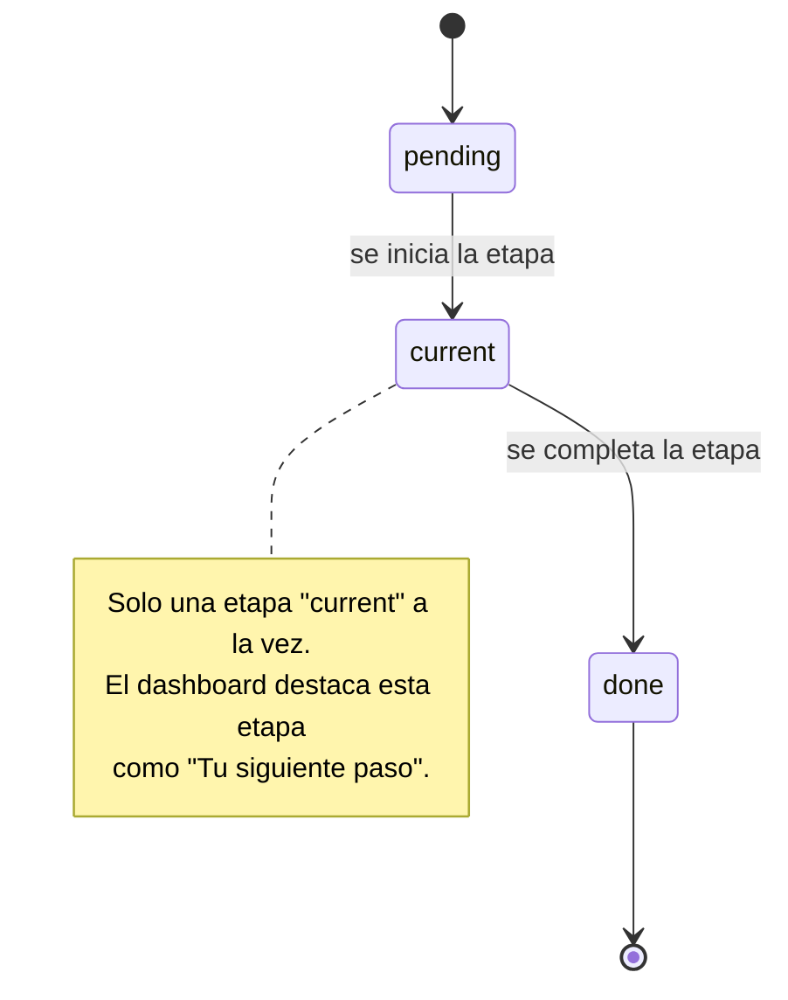
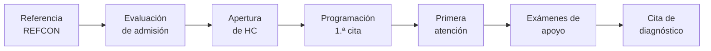
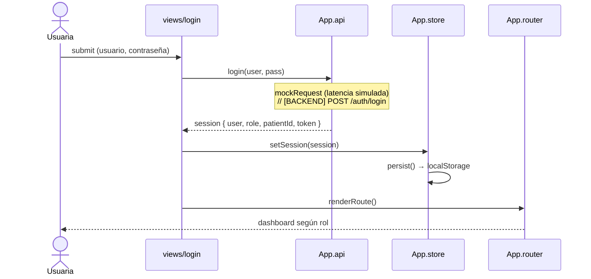
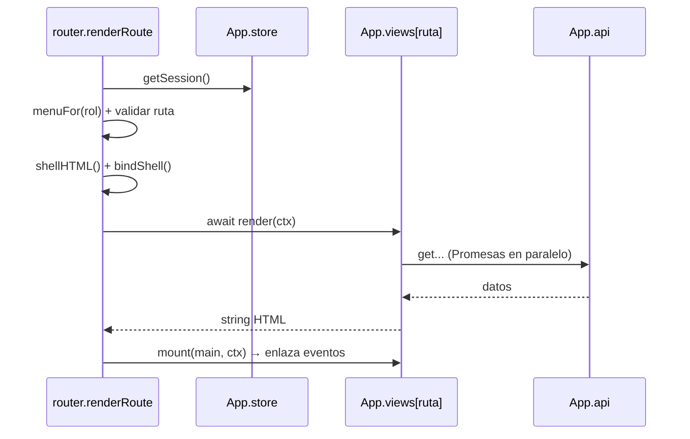
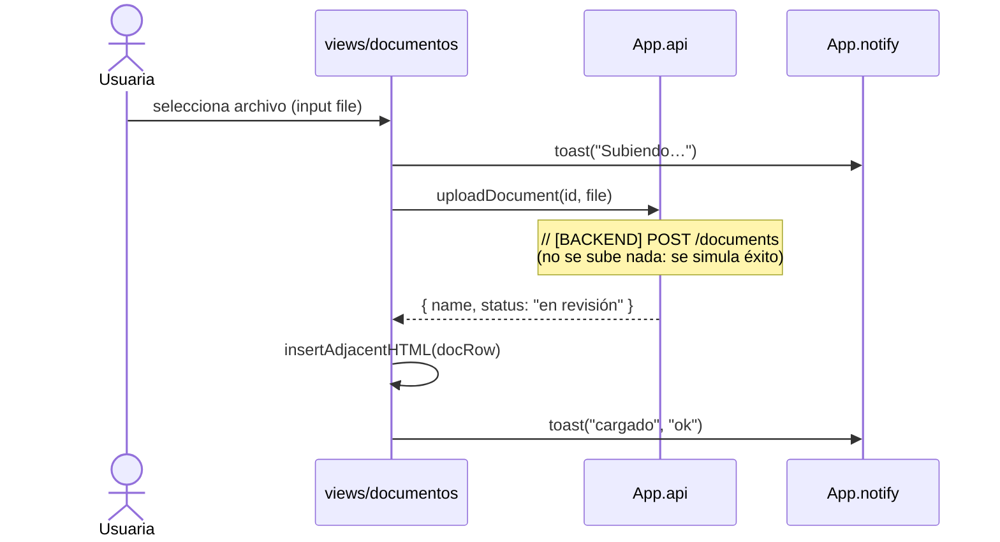
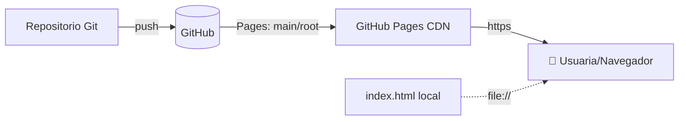

# 📐 Documentación Técnica — OncoRuta Mujer Inteligente

> Sistema digital de navegación del paciente · INEN · Hackatón Transformagob 2026
> Documento técnico de referencia para evaluación, mantenimiento y **reutilización** por la entidad pública.

---

## Tabla de contenidos

1. [Resumen técnico](#1-resumen-técnico)
2. [Tecnologías utilizadas](#2-tecnologías-utilizadas)
3. [Arquitectura general](#3-arquitectura-general)
4. [Estructura de archivos](#4-estructura-de-archivos)
5. [Modelo de módulos: el espacio de nombres `window.App`](#5-modelo-de-módulos-el-espacio-de-nombres-windowapp)
6. [Orden de carga y grafo de dependencias](#6-orden-de-carga-y-grafo-de-dependencias)
7. [Enrutamiento (router hash) y control de acceso por rol](#7-enrutamiento-router-hash-y-control-de-acceso-por-rol)
8. [Backend simulado y contrato de API](#8-backend-simulado-y-contrato-de-api)
9. [Modelo de datos](#9-modelo-de-datos)
10. [Máquina de estados de la ruta diagnóstica](#10-máquina-de-estados-de-la-ruta-diagnóstica)
11. [Flujos clave (diagramas de secuencia)](#11-flujos-clave-diagramas-de-secuencia)
12. [Accesibilidad e interculturalidad](#12-accesibilidad-e-interculturalidad)
13. [Estado, persistencia y preferencias](#13-estado-persistencia-y-preferencias)
14. [Capa de presentación y sistema de diseño (CSS)](#14-capa-de-presentación-y-sistema-de-diseño-css)
15. [Seguridad, privacidad y cumplimiento normativo](#15-seguridad-privacidad-y-cumplimiento-normativo)
16. [Pruebas y verificación](#16-pruebas-y-verificación)
17. [Despliegue](#17-despliegue)
18. [Guía para conectar un backend real](#18-guía-para-conectar-un-backend-real)
19. [Rendimiento y compatibilidad](#19-rendimiento-y-compatibilidad)
20. [Glosario](#20-glosario)

---

## 1. Resumen técnico

OncoRuta es una **Single Page Application (SPA)** del lado del cliente, construida con **HTML5, CSS3 y JavaScript (ES2020) nativo**, **sin frameworks ni dependencias externas** ni proceso de *build*. El "backend" está **simulado** en una capa de servicio desacoplada (`js/api.js`), por lo que el prototipo funciona:

- abriendo `index.html` directamente (`file://`), **o**
- servido por cualquier hosting estático (GitHub Pages, Netlify, etc.).

| Característica | Valor |
|---|---|
| Tipo | SPA cliente, *offline-capable* |
| Lenguajes | HTML5, CSS3, JavaScript (ES2020) |
| Dependencias en runtime | **Ninguna** (solo una fuente web opcional de Google Fonts) |
| Proceso de build | **Ninguno** (scripts clásicos cargados en orden) |
| Backend | Simulado (`api.js`), con contrato de endpoints documentado |
| Persistencia | `localStorage` (sesión + preferencias) |
| Líneas de código JS | ~22 archivos modulares (un archivo = una responsabilidad) |
| Patrón de módulos | Namespace global `window.App` + IIFE |
| Renderizado | Funciones puras `string -> innerHTML` + delegación de eventos |
| Enrutado | Hash router (`#/ruta`) |
| Accesibilidad | WCAG: contraste, escala de fuente, TTS, `aria-*`, foco, *skip link* |
| i18n | Español / Quechua |

---

## 2. Tecnologías utilizadas

| Capa | Tecnología | Uso en el proyecto |
|---|---|---|
| **Estructura** | HTML5 semántico | `index.html` (shell, contenedores, carga de scripts) |
| **Estilos** | CSS3 (Custom Properties, Grid, Flexbox, `conic-gradient`) | 6 hojas modulares: tokens, base, layout, componentes, vistas, accesibilidad |
| **Lógica** | JavaScript ES2020 (módulos por namespace, `async/await`, `Promise`, *template literals*, *optional chaining*) | 22 archivos en `/js` |
| **Tipografía** | Google Fonts (Inter) | Carga opcional; degrada a fuentes del sistema sin conexión |
| **Voz** | Web Speech API (`SpeechSynthesis`) | Lectura en voz alta (`a11y.js`) |
| **Persistencia** | Web Storage API (`localStorage`) | Sesión y preferencias (`store.js`) |
| **Gráficos** | CSS puro (barras con `width %`, *donut* con `conic-gradient`) | Sin librerías de charting |
| **Iconografía** | Emoji Unicode + SVG inline | Íconos accesibles y livianos |
| **Accesibilidad** | ARIA, `aria-live`, `:focus-visible`, `prefers-reduced-motion` | Transversal |
| **Despliegue** | Hosting estático (GitHub Pages / Netlify / Vercel) | Sin servidor de aplicación |
| **Verificación** | Node.js (`node --check`) + arnés de integración en `vm` | Validación de sintaxis y cableado |

**Decisión de arquitectura clave:** *vanilla stack* sin dependencias para garantizar **portabilidad, auditabilidad, longevidad y reutilización** por una entidad pública, evitando *vendor lock-in* y vulnerabilidades de cadena de suministro.

---

## 3. Arquitectura general

Arquitectura **cliente por capas** con separación estricta de responsabilidades:



**Principio rector:** las **vistas** nunca tocan los datos crudos; siempre pasan por la **capa de servicio** (`api.js`). El día que exista backend real, solo cambia `api.js`.

---

## 4. Estructura de archivos

```
/ (raíz del repositorio)
├── index.html                  # Shell HTML + carga ordenada de scripts
├── README.md                   # Documentación de producto
├── documentacion_tecnica.md    # (este documento)
├── FICHA_ENTREGABLE.md         # Ficha de propuesta (rúbrica)
├── COMO_DESPLEGAR.txt          # Guía de despliegue
│
├── assets/
│   ├── favicon.svg             # Ícono (lazo + ruta)
│   └── logo.svg                # Logotipo
│
├── css/                        # Hojas en cascada por responsabilidad
│   ├── tokens.css              # Variables de diseño (paleta, tipografía, radios)
│   ├── base.css                # Reset, tipografía base, utilidades a11y
│   ├── layout.css              # Shell, sidebar, topbar, grids, responsive
│   ├── components.css          # Botones, tarjetas, timeline, tablas, charts, modal, toast
│   ├── views.css               # Estilos específicos de cada vista
│   └── accessibility.css       # Panel de accesibilidad + clases utilitarias
│
└── js/
    ├── config.js               # APP, DEMO_USERS, ROUTES, STORAGE_KEY
    ├── i18n.js                 # Diccionarios es/qu + setLang/getLang/t
    ├── mockData.js             # ROUTE_TEMPLATE, PATIENTS, citas, estadísticas...
    ├── store.js                # Estado global + persistencia (localStorage)
    ├── components.js           # esc, badge, barChart, donut, fmtDate, ttsButton...
    ├── notifications.js        # toast() + announce() (aria-live)
    ├── api.js                  # ⚙️ Backend simulado (Promesas con latencia)
    ├── a11y.js                 # Accesibilidad/i18n runtime + panel + TTS
    ├── router.js               # Hash router + armado del shell por rol
    ├── app.js                  # Bootstrap (punto de entrada)
    └── views/                  # Una vista por archivo: { render, mount }
        ├── login.js
        ├── dashboard.js
        ├── ruta.js
        ├── citas.js
        ├── documentos.js
        ├── orientacion.js
        ├── notificaciones.js
        ├── apoyo.js
        ├── perfil.js
        ├── panel.js            # (rol admin)
        ├── pacientes.js        # (rol admin)
        └── indicadores.js      # (rol admin)
```

---

## 5. Modelo de módulos: el espacio de nombres `window.App`

Para funcionar **sin un *bundler*** y **sin ES Modules** (que los navegadores bloquean en `file://`), cada archivo es un **script clásico** envuelto en una **IIFE** que se registra en un único objeto global `window.App`. Esto preserva la modularidad (un archivo = una responsabilidad) y evita colisiones de nombres entre vistas (todas exponen `render`/`mount`).

**Patrón usado en cada archivo:**

```js
(function () {
  "use strict";
  const App = (window.App = window.App || {});

  // dependencias (ya cargadas por el orden de <script>)
  const { esc, badge } = App.components;
  const { t } = App.i18n;

  function render(ctx) { /* devuelve string HTML */ }
  function mount(root, ctx) { /* enlaza eventos */ }

  // registro en el namespace
  (App.views = App.views || {}).miVista = { render, mount };
})();
```

**Mapa del namespace `window.App`:**

| Namespace | Archivo | Expone |
|---|---|---|
| `App.config` | config.js | `APP`, `DEMO_USERS`, `ROUTES`, `STORAGE_KEY` |
| `App.i18n` | i18n.js | `setLang`, `getLang`, `t` |
| `App.data` | mockData.js | `ROUTE_TEMPLATE`, `PATIENTS`, `APPOINTMENTS`, estadísticas… |
| `App.store` | store.js | `loadFromStorage`, `getSession`, `setSession`, `getPrefs`, `setPref`, `subscribe` |
| `App.components` | components.js | `esc`, `el`, `badge`, `kpi`, `barChart`, `donut`, `fmtDate`, `dayMonth`, `emptyState`, `ttsButton`, `STATE_META` |
| `App.notify` | notifications.js | `toast`, `announce` |
| `App.api` | api.js | `login`, `getPatient`, `getJourney`, `getAppointments`, `getNotifications`, `getDocuments`, `uploadDocument`, `confirmAppointment`, `getSupportPosts`, `getAdminPatients` |
| `App.a11y` | a11y.js | `applyPrefs`, `changeFont`, `toggleContrast`, `toggleReadable`, `switchLanguage`, `speak`, `readPage`, `mountA11yPanel`, `initTTSDelegation` |
| `App.router` | router.js | `renderRoute`, `initRouter` |
| `App.views.*` | views/*.js | `{ render(ctx), mount?(root, ctx) }` por vista |

---

## 6. Orden de carga y grafo de dependencias

El orden de `<script>` en `index.html` garantiza que cada módulo encuentre sus dependencias ya registradas en `window.App` al evaluarse.

**Orden de carga:**

```
config → i18n → mockData → store → components → notifications → api → a11y
        → views/* (12) → router → app
```

**Grafo de dependencias (en tiempo de evaluación):**



> Nota: `views/login.js` referencia `App.router.renderRoute` **en tiempo de ejecución** (dentro de un manejador de evento), no en la evaluación del script; por eso puede cargarse antes que `router.js` sin problema (resolución diferida).

---

## 7. Enrutamiento (router hash) y control de acceso por rol

`router.js` implementa un **hash router** (`location.hash` → `#/ruta`) que:

1. Lee la sesión desde `App.store`.
2. Si **no hay sesión** → renderiza `views.login`.
3. Si **hay sesión** → calcula el menú permitido por **rol** (`menuFor`), valida la ruta y construye el **shell** (sidebar + topbar). Una ruta no permitida redirige a la primera ruta del rol.
4. Inyecta la vista en `#main-content` mediante `await view.render(ctx)` y luego `view.mount(main, ctx)`.

**Eventos que disparan re-render:** `hashchange` (navegación) y `lang:change` (cambio de idioma).

**Rutas por rol** (`config.js → ROUTES`):

| Rol | Rutas habilitadas |
|---|---|
| `paciente` | dashboard, ruta, citas, documentos, orientacion, notificaciones, apoyo, perfil |
| `cuidadora` | dashboard, ruta, citas, documentos, notificaciones, apoyo, perfil |
| `admin` | panel, pacientes, indicadores, perfil |


---

## 8. Backend simulado y contrato de API

Toda llamada a servidor está centralizada en `js/api.js`. La función `mockRequest(data, {ms, failRate})` devuelve una `Promise` que resuelve tras un `setTimeout` (simula latencia) con una **copia profunda** de los datos (`JSON.parse(JSON.stringify(...))`), de modo que las vistas no muten la fuente. Cada función lleva el comentario `// [BACKEND]` con su **endpoint real equivalente**.

**Contrato de API (mapa simulado → real):**

| Función (`App.api`) | Endpoint real sugerido | Método | Notas |
|---|---|---|---|
| `login(user, pass)` | `/auth/login` | POST | Validar contra ID Perú / DNI; emitir token de sesión |
| `getPatient(id)` | `/patients/:id` | GET | Requiere token + autorización del titular |
| `getJourney(id)` | `/patients/:id/journey` | GET | Combina plantilla de ruta + progreso |
| `getAppointments(id)` | `/patients/:id/appointments` | GET | |
| `getNotifications(id)` | `/patients/:id/notifications` | GET | |
| `getDocuments(id)` | `/patients/:id/documents` | GET | |
| `uploadDocument(id, file)` | `/patients/:id/documents` | POST (multipart) | Antivirus + cifrado en reposo |
| `confirmAppointment(citaId)` | `/appointments/:id` | PATCH | `{ status: "confirmada" }` |
| `getSupportPosts()` | `/community/posts` | GET/POST | Contenido moderado |
| `getAdminPatients()` | `/admin/patients` | GET | Rol + consentimiento; datos seudonimizados |

**Simulaciones explícitas (transparencia):**
- **Autenticación**: credenciales genéricas de demostración (`maria/123`, `admin/123`…).
- **Carga de documentos**: acepta cualquier archivo y simula éxito; **no se sube nada**.
- **Confirmación de cita / recordatorios / SMS**: respuesta simulada con *feedback* visual.

---

## 9. Modelo de datos

Entidades principales (en `mockData.js`), alineadas con el dominio institucional del INEN:



Además, datos **institucionales agregados** para el panel admin (ficticios/derivados de los documentos del desafío): `HC_OPENINGS`, `REFCON_DAYS`, `FIRST_APPT_STATS`, `STAGE_STATS`, `ADMIN_PATIENTS`.

---

## 10. Máquina de estados de la ruta diagnóstica

La ruta del paciente (`getJourney`) combina `ROUTE_TEMPLATE` (7 etapas, derivadas del BPMN y los 9 hitos físicos) con `PATIENT_PROGRESS` (estado por paciente). Cada etapa transita por tres estados:



**Secuencia de etapas (modelo de navegación):**



---

## 11. Flujos clave (diagramas de secuencia)

### 11.1 Inicio de sesión



### 11.2 Render de una ruta autenticada



### 11.3 Carga de documento (simulada)



---

## 12. Accesibilidad e interculturalidad

Implementado en `a11y.js`, `i18n.js`, `accessibility.css` y `base.css`.

| Característica | Implementación |
|---|---|
| **Idioma es/qu** | `i18n.js` (diccionarios) + `switchLanguage()` dispara `lang:change` → re-render |
| **Lectura en voz alta (TTS)** | Web Speech API (`SpeechSynthesisUtterance`, `es-PE`); botones "🔊 Escuchar" por delegación global |
| **Escala de fuente** | Variable CSS `--font-scale` sobre `<body>` (90 %–160 %) |
| **Alto contraste** | `[data-contrast="high"]` redefine tokens de color |
| **Lectura fácil** | `[data-readable="on"]` aumenta interletrado/interlineado |
| **Anuncios a lectores de pantalla** | Región `#a11y-live` con `aria-live="polite"` (`announce()`) |
| **Navegación por teclado** | `:focus-visible`, *skip link*, `tabindex` en `#main-content` |
| **Preferencias del SO** | `@media (prefers-reduced-motion: reduce)` |
| **Panel flotante** | Botón ♿ (`mountA11yPanel`) con todos los controles |

Las preferencias se **persisten** y se reaplican al cargar (`applyPrefs()` en el bootstrap).

---

## 13. Estado, persistencia y preferencias

`store.js` mantiene un estado mínimo en memoria y lo persiste en `localStorage` bajo la clave `oncoruta:v1`:

```js
state = {
  session: { user, role, patientId, token } | null,
  prefs:   { lang, fontScale, contrast, readable }
}
```

- **Patrón observador** (`subscribe`/`emit`) para notificar cambios.
- **Tolerante a fallos**: todas las operaciones de `localStorage` están en `try/catch`; si el almacenamiento no está disponible (p. ej. ciertos contextos `file://`), la app sigue operando en memoria.

---

## 14. Capa de presentación y sistema de diseño (CSS)

CSS en cascada por capas, con **design tokens** en `:root` (`tokens.css`):

- **Paleta**: *teal* institucional (`--brand-*`) + magenta/rosa de salud de la mujer (`--accent-*`), estados (ok/warn/info/danger) y neutros.
- **Tipografía/escala**: variables `--fs-*` y `--font-scale` (accesibilidad).
- **Layout**: `CSS Grid` para el shell (`.shell`) y `Flexbox` para componentes; *responsive* con `@media` (sidebar deslizante en móvil).
- **Componentes**: botones, tarjetas, **timeline** (ruta), tablas, **barras y *donut*** (gráficos sin librerías), modales y toasts.
- **Renderizado de gráficos**: barras con `width: %`; *donut* con `conic-gradient` calculado en `components.donut()`.

> **Seguridad de plantillas:** todo dato dinámico se interpola con `components.esc()` (escapa `& < > " '`) para mitigar inyección de HTML/XSS al construir `innerHTML`.

---

## 15. Seguridad, privacidad y cumplimiento normativo

| Aspecto | Medida en el prototipo / diseño para producción |
|---|---|
| **Datos personales (Ley N.° 29733)** | **No se usan HC reales**; datos ficticios. En producción: cifrado en tránsito/reposo, minimización, consentimiento, control de acceso por rol, seudonimización. |
| **Ley General de Salud / confidencialidad** | Mensajes de confidencialidad; separación de roles; sin exposición de datos clínicos sensibles. |
| **Interoperabilidad y reutilización (D. L. 1412 – Gobierno Digital, art. 29)** | Capa de servicio desacoplada y estándares abiertos para integración progresiva con SISINEN/REFCON. |
| **XSS** | Escape de salida (`esc()`) en toda interpolación de datos. |
| **Sin terceros de runtime** | Cero dependencias npm → reduce superficie de ataque y riesgo de cadena de suministro. |
| **Límite clínico** | La app **no diagnostica** ni sustituye la decisión médica; avisos explícitos. |
| **Sesión** | En el prototipo: `localStorage` (demo). En producción: cookie `HttpOnly`/`Secure` gestionada por el backend. |

---

## 16. Pruebas y verificación

- **Sintaxis**: `node --check` sobre los 22 archivos JS (sin errores).
- **Integración**: arnés en Node con `vm` que carga los scripts en el **orden real de `index.html`** sobre *stubs* mínimos de DOM, y verifica:
  - que se pueblan todos los namespaces de `window.App`,
  - que existen las 12 vistas con `render` válido,
  - que `dashboard`, `ruta`, `panel` e `indicadores` renderizan el HTML esperado,
  - que el cambio de idioma a quechua resuelve traducciones (`t("nav.citas") === "Tupanaykuna"`).
- **Manual**: navegación por roles, accesibilidad (TTS, contraste, idioma), carga simulada y *responsive*.

---

## 17. Despliegue

Al ser estática y sin *build*, se despliega de tres formas:

1. **Local sin servidor**: doble clic en `index.html` (`file://`).
2. **Servidor estático local** (opcional): `python -m http.server 8080` o `npx serve .`.
3. **Hosting estático**: GitHub Pages (rama `main` / root), Netlify, Vercel o Cloudflare Pages.

Como todas las rutas son **relativas**, funciona tanto en la raíz del dominio como en un subdirectorio. Ver `COMO_DESPLEGAR.txt` para el paso a paso.



---

## 18. Guía para conectar un backend real

La migración a producción es **localizada**: solo se modifica `js/api.js`. Ejemplo de reemplazo de una simulación por una llamada real:

```js
// ANTES (simulado)
function getJourney(patientId) {
  const progress = App.data.PATIENT_PROGRESS[patientId] || {};
  const journey = App.data.ROUTE_TEMPLATE.map(s => ({ ...s, ...(progress[s.key] || { state: "pending" }) }));
  return mockRequest(journey);
}

// DESPUÉS (backend real)
async function getJourney(patientId) {
  const res = await fetch(`/api/patients/${patientId}/journey`, {
    headers: { Authorization: `Bearer ${App.store.getSession().token}` },
    credentials: "include",
  });
  if (!res.ok) throw new Error("No se pudo obtener la ruta del paciente.");
  return res.json();
}
```

Como las vistas ya consumen `App.api.*` mediante `await`, **no requieren cambios**. El contrato de la sección 8 define los endpoints esperados.

---

## 19. Rendimiento y compatibilidad

- **Peso**: sin frameworks ni librerías → carga casi instantánea; ideal para conectividad limitada (pacientes de provincia).
- **Sin red en runtime**: todo el código y los datos viven en el cliente (la única petición externa opcional es la fuente Inter; si falla, degrada a fuentes del sistema).
- **Compatibilidad**: navegadores modernos (Chrome/Edge/Firefox/Safari) con soporte de ES2020, CSS Grid, `conic-gradient` y, opcionalmente, Web Speech API (la app degrada con elegancia si TTS no está disponible).
- **Responsive**: *layout* adaptable a móvil con sidebar deslizante.

---

## 20. Glosario

| Sigla | Significado |
|---|---|
| **HC** | Historia Clínica |
| **SISINEN** | Sistema Integrado Hospitalario del INEN |
| **REFCON** | Sistema de Referencia y Contrarreferencia |
| **IAFAS** | Instituciones Administradoras de Fondos de Aseguramiento en Salud |
| **IPRESS** | Instituciones Prestadoras de Servicios de Salud |
| **SPA** | Single Page Application |
| **IIFE** | Immediately Invoked Function Expression |
| **TTS** | Text-To-Speech (lectura en voz alta) |
| **WCAG** | Web Content Accessibility Guidelines |
| **BPMN** | Business Process Model and Notation |

---

*Documentación técnica · OncoRuta Mujer Inteligente · Hackatón Transformagob 2026 · INEN · #PorUnPerúDigital*
