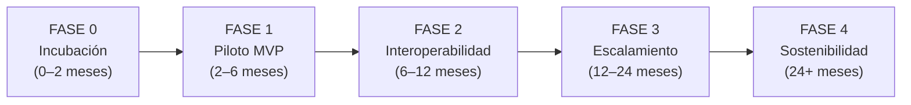
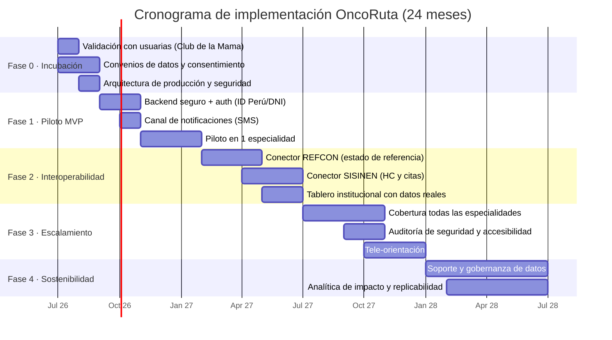
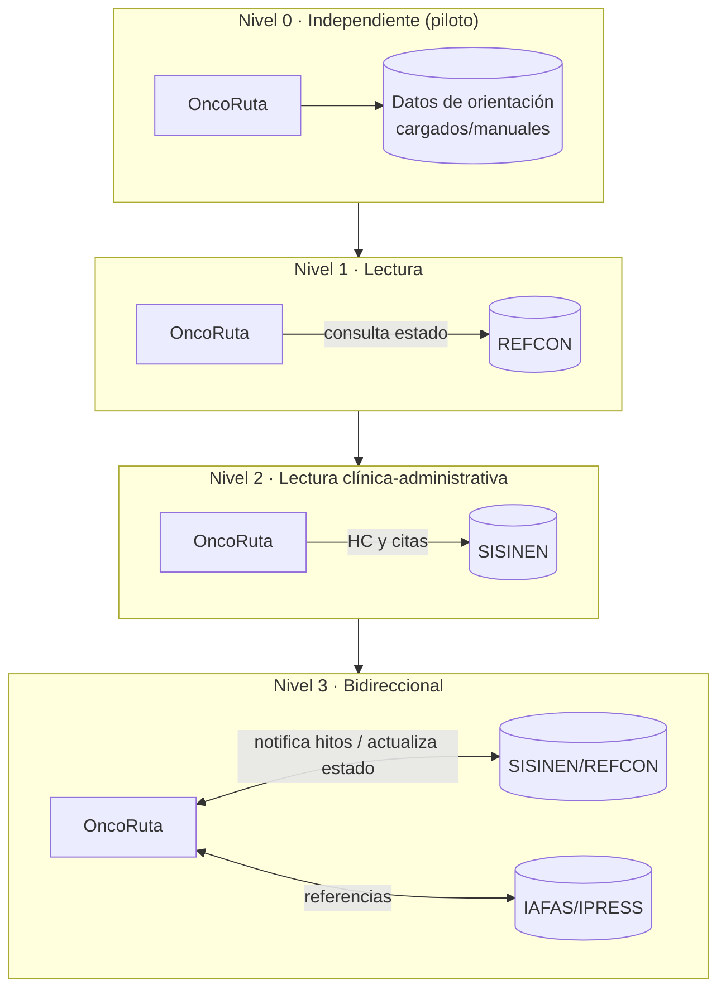
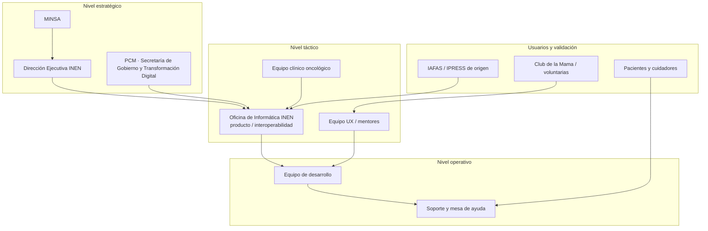
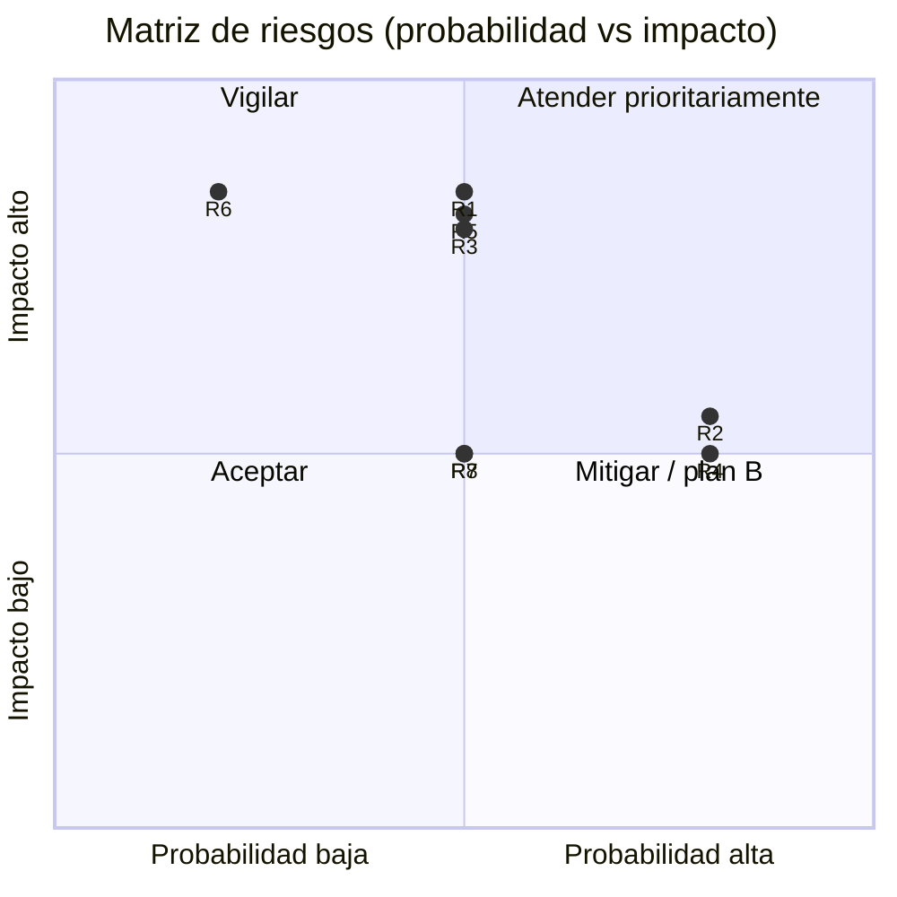

# 🧪 Plan de Viabilidad — OncoRuta Mujer Inteligente

> Sistema digital de navegación del paciente · **INEN** · Hackatón Transformagob 2026 · Desafío 14
> Ruta para convertir el prototipo en un servicio público real, sostenible e interoperable.

---

## Tabla de contenidos

1. [Resumen ejecutivo](#1-resumen-ejecutivo)
2. [Alineación con el desafío y valor público](#2-alineación-con-el-desafío-y-valor-público)
3. [Las cuatro dimensiones de viabilidad](#3-las-cuatro-dimensiones-de-viabilidad)
   - 3.1 [Viabilidad técnica](#31-viabilidad-técnica)
   - 3.2 [Viabilidad legal y normativa](#32-viabilidad-legal-y-normativa)
   - 3.3 [Viabilidad operativa e institucional](#33-viabilidad-operativa-e-institucional)
   - 3.4 [Viabilidad económica y sostenibilidad](#34-viabilidad-económica-y-sostenibilidad)
4. [Apertura, interoperabilidad y ética digital](#4-apertura-interoperabilidad-y-ética-digital)
5. [Hoja de ruta de implementación (fases)](#5-hoja-de-ruta-de-implementación-fases)
6. [Cronograma (Gantt)](#6-cronograma-gantt)
7. [Plan de interoperabilidad progresiva](#7-plan-de-interoperabilidad-progresiva)
8. [Presupuesto estimado](#8-presupuesto-estimado)
9. [Modelo de gobernanza y actores](#9-modelo-de-gobernanza-y-actores)
10. [Gestión de riesgos](#10-gestión-de-riesgos)
11. [Plan de gestión del cambio y adopción](#11-plan-de-gestión-del-cambio-y-adopción)
12. [Indicadores de éxito y monitoreo (M&E)](#12-indicadores-de-éxito-y-monitoreo-me)
13. [Análisis FODA](#13-análisis-foda)
14. [Plan de escalamiento nacional](#14-plan-de-escalamiento-nacional)
15. [Cobertura de la rúbrica de evaluación](#15-cobertura-de-la-rúbrica-de-evaluación)

---

## 1. Resumen ejecutivo

**OncoRuta Mujer Inteligente** es un sistema de navegación del paciente que ataca la **tensión central** del Desafío 14: las **demoras y la fragmentación** del proceso diagnóstico de cáncer de mama y cuello uterino en mujeres vulnerables de 30 a 65 años atendidas en el INEN.

El presente plan demuestra que la solución es **realizable, sostenible y escalable**, partiendo de un **prototipo funcional ya construido** y aprovechando el **compromiso post-hackatón del INEN** (evaluación, incubación y pilotaje). La estrategia es de **bajo riesgo y costo incremental**: se despliega primero como capa de orientación al paciente (sin tocar los sistemas clínicos) y se integra **progresivamente** con SISINEN y REFCON.

| Indicador del problema (línea base, fuente del desafío) | Meta del plan |
|---|---|
| Programación de 1.ª cita: **93.3 %** tarda +1 día (prom. 3 d 14 h) | Reducir el promedio y el % >1 día con agenda digital y alertas |
| Atención de referencias REFCON: **11.54 días** prom. (hasta 20 en marzo) | Visibilizar y reducir tiempos con seguimiento extremo a extremo |
| **51.29 %** de casos sin estadio clínico registrado | Apoyar el registro oportuno y la trazabilidad del caso |
| **~30 %** diagnosticadas en estadios avanzados (III–IV) | Contribuir al diagnóstico temprano reduciendo abandonos y demoras |
| **70 %** de pacientes se desplazaba repetidamente sin orientación | Reducir viajes y trámites con orientación remota y recordatorios |

---

## 2. Alineación con el desafío y valor público

El plan responde **directamente** a las funcionalidades mínimas exigidas y al alcance esperado de los documentos del reto:

- **Centralización del estado del caso y siguientes pasos** → ruta de 7 etapas derivada del BPMN y los 9 hitos físicos.
- **Recordatorios, alertas y notificaciones** → reduce inasistencias y tiempos muertos.
- **Orientación clara, inclusiva e intercultural** → bilingüe español/quechua, lectura en voz alta, lectura fácil (responde a los 5 perfiles de usuaria).

**Valor público diferenciado:** equidad para mujeres vulnerables (jefas de hogar, con discapacidad, interculturales, de zonas alejadas), reducción de costos familiares de traslado, disminución de la ansiedad (insights del trabajo de campo) y, en agregado, **mayor probabilidad de diagnóstico temprano** —el objetivo de fondo del desafío y de la **Ley N.° 31336, Ley Nacional del Cáncer** y la **Política Nacional Multisectorial de Salud al 2030**.

---

## 3. Las cuatro dimensiones de viabilidad

### 3.1 Viabilidad técnica

| Aspecto | Estado / Estrategia | Nivel de riesgo |
|---|---|---|
| **Prototipo** | Funcional y demostrable (SPA sin dependencias, ya verificado) | 🟢 Bajo |
| **Arquitectura** | Capa de servicio desacoplada (`api.js`): migrar a backend real solo cambia esa capa | 🟢 Bajo |
| **Interoperabilidad** | Progresiva con SISINEN/REFCON vía API (no reemplaza sistemas) | 🟡 Medio |
| **Infraestructura** | Hosting estático + API en nube estatal/gobierno; bajo consumo | 🟢 Bajo |
| **Conectividad limitada** | App ligera + canal SMS para pacientes de provincia | 🟡 Medio |
| **Escalabilidad** | Arquitectura *stateless* en frontend; backend escalable horizontalmente | 🟢 Bajo |

**Conclusión:** la base técnica ya existe; el esfuerzo se concentra en el backend seguro y en los conectores de interoperabilidad.

### 3.2 Viabilidad legal y normativa

| Norma | Implicancia | Cumplimiento previsto |
|---|---|---|
| **Ley N.° 29733** — Protección de Datos Personales | Datos de salud son datos sensibles | Consentimiento informado, minimización, cifrado, seudonimización, registro de banco de datos ante la APDP |
| **Ley N.° 26842** — Ley General de Salud | Confidencialidad de la información clínica | Control de acceso por rol; sin exposición de datos sensibles innecesarios |
| **Ley N.° 31336** — Ley Nacional del Cáncer y su Reglamento | Garantía de atención oportuna y continua | La solución operativiza la continuidad y el seguimiento del paciente |
| **D. L. 1412** — Ley de Gobierno Digital (art. 29, interoperabilidad) | Reutilización e interoperabilidad del Estado | Componentes abiertos, estándares y conectores progresivos |
| **Lineamientos PCM** de accesibilidad y gobierno digital | Servicios accesibles e inclusivos | WCAG, multilingüe, lectura en voz alta |
| **Política Nacional Multisectorial de Salud al 2030** | Marco estratégico | Alinea el diagnóstico temprano y la equidad en salud |

> **Hito legal crítico:** suscripción de convenios de tratamiento de datos y consentimiento del paciente antes del piloto con datos reales (en la hackatón **no** se usan HC reales).

### 3.3 Viabilidad operativa e institucional

- **Patrocinio institucional**: la **Oficina de Informática del INEN** (Dirección Ejecutiva) lidera; existe **compromiso post-hackatón** de incubación y pilotaje.
- **Mentores especialistas** ya identificados (salud pública, oncología, TI/interoperabilidad, UX, gestión por procesos) → equipo de acompañamiento.
- **Usuarias reales para validación**: voluntarias y representantes del **Club de la Mama**.
- **Impacto en procesos**: la solución se monta **sobre** el flujo actual (no lo interrumpe); el personal administrativo y clínico mantiene sus sistemas.

### 3.4 Viabilidad económica y sostenibilidad

- **Costo incremental bajo**: sin licencias ni infraestructura de gran escala (alcance fuera del reto respetado).
- **Modelo de sostenibilidad**: financiamiento público (presupuesto institucional INEN/MINSA) + cooperación (CAF/CLAD) para el piloto; operación posterior absorbida como servicio digital institucional.
- **Retorno social**: reducción de costos familiares (transporte, días perdidos), descongestión de ventanillas presenciales y, sobre todo, valor en salud por diagnóstico temprano.

---

## 4. Apertura, interoperabilidad y ética digital

- **Código abierto y reutilizable** (sin *vendor lock-in*): núcleo en HTML/CSS/JS estándar, módulos `i18n` y `a11y` reaprovechables por otras entidades.
- **Interoperabilidad por estándares**: API REST documentada; mapeo a entidades reales (HC, REFCON, IAFAS/IPRESS) para integración por etapas.
- **Ética digital y salvaguardas**: la app **no diagnostica** ni sustituye la decisión clínica; consentimiento, transparencia del tratamiento de datos y enfoque inclusivo/intercultural alineados al **D. L. 1412 (art. 29)** y la **Ley N.° 29733**.
- **No discriminación algorítmica**: la priorización de casos es **transparente y basada en reglas** (tiempo de espera + vulnerabilidad), auditable y sin "caja negra".

---

## 5. Hoja de ruta de implementación (fases)

| Fase | Objetivo | Entregables clave |
|---|---|---|
| **0 · Incubación** | Validar con usuarias y formalizar | Validación con Club de la Mama; convenios de datos; backlog priorizado; arquitectura de producción y modelo de seguridad |
| **1 · Piloto MVP** | Servicio real en 1 especialidad | Backend seguro; autenticación ID Perú/DNI; notificaciones SMS reales; piloto en Ginecología/MTB; consentimiento informado |
| **2 · Interoperabilidad** | Conectar a sistemas INEN | Conectores REFCON (estado de referencia) y SISINEN (HC y citas); tablero institucional con datos reales |
| **3 · Escalamiento** | Cobertura total INEN | Todas las especialidades; tele-orientación; auditoría de seguridad; certificación de accesibilidad |
| **4 · Sostenibilidad** | Operación continua y mejora | Mesa de soporte; gobernanza de datos; analítica de impacto; replicabilidad a otras IPRESS |

---

## 6. Cronograma (Gantt)

---

## 7. Plan de interoperabilidad progresiva

La integración es **gradual y no disruptiva**, respetando la restricción del reto (no requerir integración obligatoria ni acceso a HC reales durante la hackatón):

Cada nivel aporta valor por sí mismo; si un conector se retrasa, el servicio **sigue operando** en el nivel anterior.

---

## 8. Presupuesto estimado

Estimación **referencial** para 24 meses (en soles peruanos, S/). Los montos finales dependen de la modalidad de contratación pública y de la infraestructura estatal disponible.

| Rubro | Fase principal | Estimación (S/) |
|---|---|---|
| Equipo de desarrollo (backend, frontend, QA, devops) | 1–3 | 280 000 – 360 000 |
| Diseño UX/UofX e interculturalidad (validación con usuarias) | 0–1 | 35 000 – 55 000 |
| Infraestructura en nube (cómputo, almacenamiento, respaldos) | 1–4 | 24 000 – 48 000 |
| Canal de notificaciones (SMS/mensajería) | 1–4 | 20 000 – 40 000 |
| Seguridad: auditoría, pentesting, cumplimiento Ley 29733 | 2–3 | 30 000 – 50 000 |
| Interoperabilidad (conectores REFCON/SISINEN) | 2 | 60 000 – 90 000 |
| Gestión del cambio y capacitación | 1–4 | 25 000 – 40 000 |
| Soporte y mantenimiento (anual, sostenibilidad) | 4 | 40 000 – 60 000 / año |
| **Total estimado (24 meses, sin soporte recurrente)** | | **≈ S/ 494 000 – 743 000** |

> **Optimización de costo:** el frontend reutiliza el prototipo existente (cero costo de licencias, sin frameworks de pago), y la nube puede ser infraestructura estatal (GOB.PE), reduciendo el gasto.

---

## 9. Modelo de gobernanza y actores

**Roles clave:** *Product Owner* (Oficina de Informática INEN), referente clínico (oncología), referente legal/datos, líder de interoperabilidad y enlace con el Club de la Mama para validación continua.

---

## 10. Gestión de riesgos

| # | Riesgo | Prob. | Impacto | Mitigación |
|---|---|---|---|---|
| R1 | Brecha en protección de datos sensibles | Media | Alto | Cifrado, seudonimización, auditoría, consentimiento, cumplimiento Ley 29733 |
| R2 | Retraso en interoperabilidad con SISINEN/REFCON | Alta | Medio | Diseño por niveles; el servicio opera en el nivel previo |
| R3 | Baja adopción por personal o pacientes | Media | Alto | Gestión del cambio, capacitación, UX validada, acceso para cuidador |
| R4 | Conectividad limitada en provincias | Alta | Medio | App ligera + SMS + tele-orientación |
| R5 | Sostenibilidad financiera post-piloto | Media | Alto | Inserción en presupuesto institucional; cooperación CAF/CLAD |
| R6 | Expectativas clínicas indebidas (autodiagnóstico) | Baja | Alto | Avisos explícitos; sin diagnóstico automatizado |
| R7 | Barreras idiomáticas/culturales | Media | Medio | Interfaz quechua, orientación intercultural, ampliable a más lenguas |
| R8 | Rotación del equipo / continuidad | Media | Medio | Documentación técnica completa; código abierto y comentado |

---

## 11. Plan de gestión del cambio y adopción

1. **Sensibilización**: socializar el valor de la navegación del paciente con personal clínico y administrativo.
2. **Capacitación**: guías y videos cortos para pacientes (incluida versión quechua) y para el personal.
3. **Campeones internos**: identificar referentes por servicio que impulsen el uso.
4. **Acompañamiento de pares**: Club de la Mama como red de soporte y difusión confiable.
5. **Retroalimentación continua**: canal de mejoras y métricas de uso para iterar.
6. **Despliegue gradual**: empezar por una especialidad y expandir según aprendizaje.

---

## 12. Indicadores de éxito y monitoreo (M&E)

| Indicador | Línea base (desafío) | Meta piloto | Meta escalamiento |
|---|---|---|---|
| Tiempo promedio de programación de 1.ª cita | 3 d 14 h | −20 % | −40 % |
| % de citas que tardan +1 día | 93.3 % | ≤ 80 % | ≤ 60 % |
| Tasa de inasistencia a citas (no-show) | s/d | −15 % | −30 % |
| % de casos con estadio clínico registrado oportunamente | ~49 % | +10 pp | +25 pp |
| % de pacientes que reportan claridad sobre su proceso | s/d | ≥ 70 % | ≥ 85 % |
| Reducción de viajes/desplazamientos evitables | 70 % se desplazaba repetidamente | −20 % | −40 % |
| Satisfacción de la paciente (CSAT) | s/d | ≥ 4/5 | ≥ 4.3/5 |
| Cobertura de pacientes activas en la plataforma | 0 | ≥ 30 % del servicio piloto | ≥ 70 % institucional |

**Mecanismo de M&E:** tablero institucional con datos anonimizados, encuestas a usuarias (con apoyo del Club de la Mama) y revisión trimestral de indicadores por la Oficina de Informática.

---

## 13. Análisis FODA

| Fortalezas | Oportunidades |
|---|---|
| Prototipo funcional ya construido y verificado | Compromiso post-hackatón del INEN (incubación/pilotaje) |
| Stack abierto sin dependencias ni licencias | Cooperación CAF/CLAD y agenda nacional de gobierno digital |
| Accesible e intercultural (es/qu, TTS, WCAG) | Marco normativo favorable (Ley del Cáncer, Política 2030) |
| Arquitectura desacoplada (fácil de evolucionar) | Demanda creciente de servicios oncológicos digitales |

| Debilidades | Amenazas |
|---|---|
| Backend aún simulado (a construir) | Tiempos y complejidad de interoperabilidad estatal |
| Dependencia de integración con sistemas heredados | Restricciones presupuestales del sector público |
| Requiere gobernanza de datos robusta | Riesgos de privacidad si no se gestionan bien |
| Conectividad desigual en zonas alejadas | Rotación de personal / continuidad del proyecto |

---

## 14. Plan de escalamiento nacional

1. **INEN-Lima (núcleo)** → consolidar como referencia nacional oncológica.
2. **Replicabilidad a IPRESS regionales** → como el sistema es abierto e interoperable, otras instituciones pueden adoptar el núcleo de navegación del paciente.
3. **Estándar reutilizable** → publicar el componente de navegación y los módulos `a11y`/`i18n` como pieza reutilizable de gobierno digital para otros servicios de salud.
4. **Articulación con REFCON nacional** → mejorar la continuidad referencia–contrarreferencia a nivel sistémico.

---

## 15. Cobertura de la rúbrica de evaluación

| Criterio (peso) | Cómo lo cubre este plan |
|---|---|
| **Calidad de la solución (35 %)** | Secciones 1–2: ataca la tensión central (demoras/fragmentación) con metas medibles sobre las cifras reales del desafío y valor público diferenciado (equidad, interculturalidad). |
| **Prototipo funcional y viabilidad (30 %)** | Sección 3 (las 4 dimensiones: técnica, legal, operativa, económica), 5–8 (hoja de ruta, cronograma, presupuesto): viabilidad razonable con riesgos mitigables y ruta clara de continuidad institucional. |
| **Apertura, reutilización y ética (20 %)** | Sección 4 y 7: componentes abiertos, interoperabilidad progresiva por estándares, salvaguardas alineadas a Ley 29733 y D. L. 1412 (art. 29); priorización transparente y auditable. |
| **Presentación y documentación (15 %)** | Documento estructurado con diagramas (roadmap, Gantt, gobernanza, matriz de riesgos), tablas y M&E que facilitan la evaluación y la reutilización por la entidad. |

---

*Plan de viabilidad · OncoRuta Mujer Inteligente · Hackatón Transformagob 2026 · INEN · #PorUnPerúDigital*
